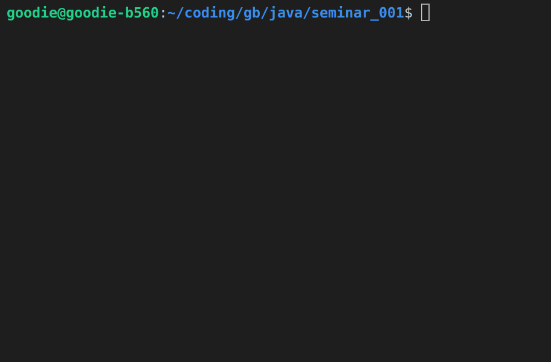

# Программа для нахождения треугольного числа $T~n~$

Реализованы следующие возможности:
- Нахождение треугольного числа по заданному пользователем $n$
- Доказательство того, что $T~n~$ действительно является треугольным
- Визуальное представление треугольного числа $T~n~$